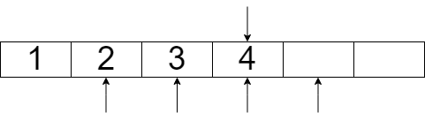
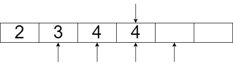
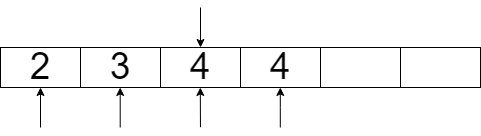
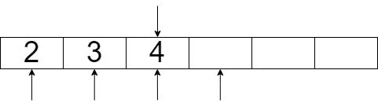

Projekt jest dostępny w repozytorium github: \
<https://github.com/Kacper-spare/publish-subscribe>


# Struktury dancyh

Projekt został wykonany z użyciem dwóch struktur danych.

1. struktura TQueue:

    ```c
    struct TQueue
    {
        int capacity;
        int tail;
        void** messageArray;
        TNode* subscribers;

        pthread_cond_t lockGetMsg;
        pthread_cond_t lockAddMsg;
        pthread_cond_t lockEditing;
        pthread_mutex_t mutexGetMsg;
        pthread_mutex_t mutexAddMsg;
        pthread_mutex_t mutexEditing;

        int activeReaders;
    };
    ```
    wyróżniamy tutaj dwa rodzaje zmiennych
    
    - zmienne synchronizujące

        ```c
        pthread_cond_t lockGetMsg;
        pthread_cond_t lockAddMsg;
        pthread_cond_t lockEditing;
        pthread_mutex_t mutexGetMsg;
        pthread_mutex_t mutexAddMsg;
        pthread_mutex_t mutexEditing;
        int activeReaders; //liczba wątków aktualnie czytających informacje kolejki
        ```
    
        zmienne te służą wyłącznie do synchronizacji wątków w programie z umożliwieniem istnienia wielu różnych struktór TQueue
    
    - zmienne kolejki TQueue

        ```c
        int capacity; //maksymalna ilość wiadomości w kolejce
        int tail; //indeks ostatniej wiadomości w kolejce
        void** messageArray; //lista dynamiczna zawierająca wiadomości
        TNode* subscribers; //lista jednokierunkowa z id wątków zasubskrybowanych
        ```

        zmienne te obsługują informacje kolejki odpowiednio opisane w komentarzu obok zmiennej. Zmienna `subscribers` jest stworzona przy użyciu struktury której implementacja wygląda następująco.
2. Struktura `TNode`

    ```c
    typedef struct Node
    {
        int head; //informacja o indeksie koljenej wiadomości do przeczytania
        pthread_t* data; //wskaźnik do id wątku
        struct Node* next; //wskaźnik do kolejnego elementu listy
    } TNode;
    ```

    struktura ta umożliwia dynamiczną alokacje i dealokacje dodatkowych subskrybentów bez używania funkcji `realloc()` która może zwrócić `NULL` i usunąć całą liste. Sposób implementacji subskrybentów jest preferencją nie ma żadnego realnego powodu takiej implementacji ponad inną.
        
# Funkcje

Poniższe funkcje zawarte tutaj są funkcjami związanymi z kolejką jednokierunkową pozostałe funkcje są zaimplementowane zgodnie z specyfikacją projektu.

1. `TNode* newNode(pthread_t* thread, TQueue* queue)` -- tworzy nowy wskaźnik do   kolejnego elementu listy.

2. `TNode* removeNode(TNode* head)` -- usuwa element podany, funkcja ta jest zawsze    używana dla pewnego podzbioru listy i zawsze usuwa pierwszy element podzbioru.

# Algorytm

## Implementacja

### `destroyQueue(TQueue* queue)` -- niszczy kolejke, musi zwolnić mutex związany z  blokowaniem dostępu do kolejki aby go usunąć, może więc powodować błędy typu `read access violation`.

### `setSize(TQueue* queue, int size)`, `unsubscribe(TQueue *queue, pthread_t thread)`, `removeMsg(TQueue *queue, void *msg)` -- funkcje te korzystają z przesunięcia tablicy jednowymiarowej o n pozycji w lewo przykład:

\pagebreak

górna strzałka reprezentuje informacje `tail` w strukturze `TQueue` dolne strzałki reprezentują informacje `head` w zmiennej `subscribers`

wykonamy przesunięcie o `n = 1` 

{width=50%}\

{width=50%}\

Na końcu przemieszczenia o `n = 1` otrzymujemy

{width=50%}\

Teraz algorytm poprawi wskaźniki przesuwając je odpowienio 

{width=50%}\

I ostatecznie usunie zduplikowaną wiadomość (nie jest to jednak konieczne z perspektywy pozostałych funkcji)

{width=50%}\

## Zabezpieczenia

W programie występuje kilka zabezpieczneń związanych z obsługą informacji kolejki.

### Sekcja krytyczna dla wątku czytającego

```c
pthread_mutex_lock(&queue->mutexEditing);
queue->activeReaders++;
pthread_mutex_unlock(&queue->mutexEditing);

...

pthread_mutex_lock(&queue->mutexEditing);
queue->activeReaders--;
if (queue->activeReaders == 0)
{
    pthread_cond_broadcast(&queue->lockEditing);
}
pthread_mutex_unlock(&queue->mutexEditing);
```

Zabezpiecznie to informuje wątki edytujące informacje o instnieniu wątku który aktualnie czyta infomacje z `TQueue` czyli informacja o tym że nie powinien zmieniać tych informacji dopóki inne wątki czytają je. Natomiast druga część informuje wątlo uśpione przez zmienną warunkową o potencjalnej możliwości edycji `TQueue`. Informujemy wszystkie wątki ponieważ kiedy jeden z nich skończy zadanie to drugi może rozpocząć swoje bez czekania aż znowu wystąpi sygnał na danej zmiennej warunkowej.

### Sekcja krytyczna dla wątku edytującego

```c
pthread_mutex_lock(&queue->mutexEditing);
while (queue->activeReaders != 0)
{
    pthread_cond_wait(&queue->lockEditing, &queue->mutexEditing);
}

...

pthread_mutex_unlock(&queue->mutexEditing);
```

Sekcja krytyczna występuje na całości funkcji (ponieważ edytujemy) co zatrzymuje inne wątki od edycji i czytania informacji w kolejce. Można ten problem porónać do problemu pisarzy i czytających z priorytetem dla czytających.

### Omówienie odporności na problemy przetważania współbieżnego \

#### Zakleszczenie \

Nie powinno wystąpić. Zasobem żądanym przez wątki jest dostęp do struktury `TQueue`, wątki rywalizują o dostęp do tej struktury, ale jest ona chroniona jednym mutexem. Nie jest to jednak wyustarczającym warunkiem do powstania zakleszczenie. Zakleszczenie mogłoby wystąpić jeśli przy usypianiu odpowieni mutex nie zostałby zwolniony.

#### Aktywne oczekiwanie \

Program nie zawiera pętli z uśpieniem typu `sleep(n)`, ani pętli które wyłącznie sprawdzają swój warunek (np. `while (queue->activeReaders != 0)`). Występują natomiast uśpienie jak przedstawione w [sekcji krytycznej dla wątku edytującego](#sekcja-krytyczna-dla-wątku-edytującego) które pozwala na uśpienie wątku i oczekiwanie na otrzymanie sygnału który obudzi wątek z powrotem do działania.

#### Głodzenie \

Jak powiedziane wcześniej program jest podobny do problemu piszących i czytających z priorytetem dla czytających co pozwala na głodzenie wątków piszących. Dodanie kolejnego mutexa który by kontrolował zezwolnie na czytanie spowodowało by odwrócenie piorytetu (głodznie wątków czytających), jednakże specyfikacja projektu mówi o blokowaniu się wątków, które próbują odebrać wiadomości kiedy nie ma nowej wiadomości do odebrania. Na tej podstawie można stwierdzić że głodzenie może wystąpić jedynie kiedy wątki będą wywoływać funkcje `getAvailable(TQueue *queue, pthread_t thread)`. Odwrócenie priorytetu doprowadzi do jednakowego problemu poprzez wywoływanie funkcji edytujących.