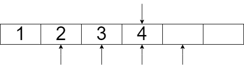
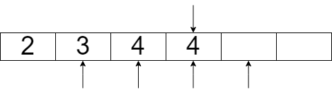
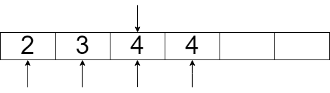
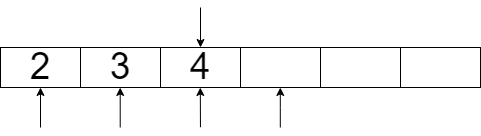

Projekt jest dostępny w repozytorium github: \
<https://github.com/Kacper-spare/publish-subscribe>


# Struktury dancyh

Projekt został wykonany z użyciem dwóch struktur danych.

1. struktura TQueue:

    ```c
    struct TQueue
    {
        pthread_cond_t lockGetMsg;
        pthread_cond_t lockAddMsg;
        pthread_cond_t lockEditing;
        pthread_mutex_t mutexEditing;

        int capacity;
        int tail;
        int start;
        TNode* subscribers;
        void** messageArray;
    };
    ```
    wyróżniamy tutaj dwa rodzaje zmiennych
    
    - zmienne synchronizujące

        ```c
        pthread_cond_t lockGetMsg;
        pthread_cond_t lockAddMsg;
        pthread_cond_t lockEditing;
        pthread_mutex_t mutexEditing;
        ```

        zmienne te służą wyłącznie do synchronizacji wątków w programie z umożliwieniem istnienia wielu różnych struktur `TQueue`

    \pagebreak
    
    - zmienne kolejki TQueue

        ```c
        int capacity; //maksymalna ilość wiadomości w kolejce
        int tail; //indeks ostatniej wiadomości w kolejce
        int start; //indeks pierwszego elementu kolejki
        void** messageArray; //lista dynamiczna zawierająca wiadomości
        TNode* subscribers; //lista jednokierunkowa z id wątków zasubskrybowanych
        ```

        zmienne te obsługują informacje kolejki odpowiednio opisane w komentarzu obok zmiennej. Zmienna `subscribers` jest stworzona przy użyciu struktury, której implementacja wygląda następująco.

2. Struktura `TNode`

    ```c
    typedef struct Node
    {
        int head; //informacja o indeksie kolejnej  wiadomości do przeczytania
        pthread_t* data; //wskaźnik do id wątku
        struct Node* next; //wskaźnik do kolejnego elementu listy
    } TNode;
    ```

    struktura ta umożliwia dynamiczną alokacje i dealokacje dodatkowych subskrybentów bez używania funkcji `realloc()` która może zwrócić `NULL` i usunąć całą listę. Sposób implementacji subskrybentów jest preferencją.
        
# Funkcje

Poniższe funkcje zawarte tutaj są funkcjami związanymi z kolejką jednokierunkową pozostałe funkcje są zaimplementowane zgodnie z specyfikacją projektu.

1. `TNode* newNode(pthread_t* thread, TQueue* queue)` -- tworzy nowy wskaźnik do kolejnego elementu listy.

2. `TNode* removeNode(TNode* head)` -- usuwa element podany, funkcja ta jest zawsze używana dla pewnego podzbioru listy i zawsze usuwa pierwszy element podzbioru.

3. `void shift(TQueue *queue)` -- przesuwa elementy kolejki o start w lewo, służy jako mechanizm opóźnienia rzeczywistego usunięcia wiadomości

# Algorytm

## Implementacja

### `destroyQueue(TQueue* queue)` -- niszczy kolejkę, musi zwolnić mutex związany z blokowaniem dostępu do kolejki, aby go usunąć, może więc powodować błędy typu `read access violation`.

### `setSize(TQueue* queue, int size)`, `unsubscribe(TQueue *queue, pthread_t thread)`, `removeMsg(TQueue *queue, void *msg)` -- funkcje te korzystają z przesunięcia tablicy jednowymiarowej o n pozycji w lewo przykład:

\pagebreak

górna strzałka reprezentuje informacje `tail` w strukturze `TQueue` dolne strzałki reprezentują informacje `head` w zmiennej `subscribers`

wykonamy przesunięcie o `n = 1` 

{width=50%}\

{width=50%}\

Na końcu przemieszczenia o `n = 1` otrzymujemy

{width=50%}\

Teraz algorytm poprawi wskaźniki przesuwając je odpowiednio 

{width=50%}\

I ostatecznie usunie zduplikowaną wiadomość (nie jest to jednak konieczne z perspektywy pozostałych funkcji)

{width=50%}\

### `unsubscribe(TQueue *queue, pthread_t thread)` -- po usunięciu subskrybenta sprawdza czy jest jakaś wiadomość do usunięcia

## Zabezpieczenia

W programie występuje zabezpieczenie związanych z obsługą informacji w strukturze `TQueue`.

### Sekcja krytyczna dla wątku

```c
pthread_mutex_lock(&queue->mutexEditing);

...

pthread_mutex_unlock(&queue->mutexEditing);
```

Sekcja krytyczna występuje na całości funkcji co zatrzymuje inne wątki od edycji i czytania informacji w kolejce.

### Omówienie odporności na problemy przetważania współbieżnego \

#### Zakleszczenie \

Nie powinno wystąpić. Zasobem żądanym przez wątki jest dostęp do struktury `TQueue`, wątki rywalizują o dostęp do tej struktury, ale jest ona chroniona jednym mutexem. Nie jest to jednak wystarczającym warunkiem do powstania zakleszczenie. Zakleszczenie mogłoby wystąpić, jeśli przy usypianiu odpowiedni mutex nie zostałby zwolniony.

#### Aktywne oczekiwanie \

Program nie zawiera pętli z uśpieniem typu `sleep(n)`, ani pętli które wyłącznie sprawdzają swój warunek (np. `while (queue->activeReaders != 0)`). Występują natomiast uśpienie które pozwala na zatrzymanie pracy wątku i oczekiwanie na otrzymanie sygnału który obudzi wątek z powrotem do działania.

#### Głodzenie \

Głodzenie wątku może występować, jednakże będzie ono związane z sposobem dawania dostępu do procesora przez system operacyjny a nie sam program.

# Przykład użycia

Program, który będzie analizowany

```c
void* function(void* args)
{
    subscribe((TQueue*) args, pthread_self());
    for (int i = 0; i < 10; i++)
    {
        printf("%d\n", *(int*)getMsg((TQueue*) args, pthread_self()));
    }
    unsubscribe((TQueue*) args, pthread_self());
}

int main()
{
    int sizeOfQueue = 10;
    int array[20] = {0};
    TQueue* queue = createQueue(sizeOfQueue);

    pthread_t threads[7];
    
    for (int i = 0; i < 7; i++)
    {
        pthread_create(&threads[i], NULL, function, (void*) queue);
    }
    for (int i = 0; i < 20; i++)
    {
        array[i] = i;
        addMsg(queue, (void*)(&array[i]));
    }
    
    
    for (int i = 0; i < 7; i++)
    {
        pthread_join(threads[i], NULL);
    }
    destroyQueue(queue);
}
```

Program wywołuje kolejno `createQueue(sizeOfQueue)` następnie tworzy 7 wątków każdy z nich subskrybuje do kolejki `queue` następnie 10 razy odbiera wiadomość poprzez `getMsg((TQueue*) args, pthread_self())` i wyświetla ją w terminalu a na koniec wywoła `unsubscribe(TQueue* queue)` z kolejki `queue`. W trakcie kiedy funkcja `function(void* args)` się wykonuje wielowątkowo wątek główny dodaje 20 wiadomości. Na koniec programu kolejka jest usuwana.

| Faza | T0 | T1 | T2 | T3 | T4 | T5 | T6 | T7 |
|---|---|---|---|---|---|---|---|---|
| 1: |  | sub(Q) | sub(Q) | sub(Q) | sub(Q) | sub(Q) | sub(Q) |  |
| 2: | add(0) |  |  |  |  |  |  |  |
| 3: | add(1) |  |  |  |  |  |  |  |
| 4: | add(2) |  |  |  |  |  |  |  |
| 5: |  |  |  |  |  |  |  | sub(Q) |
| 6: | add(3) |  |  |  |  |  |  |  |
| 7: | add(4) |  |  |  |  |  |  |  |
| 8: | add(5) |  |  |  |  |  |  |  |
| 9: | add(6) |  |  |  |  |  |  |  |
| 10: | add(7) |  |  |  |  |  |  |  |
| 11: |  | 0&larr;get(Q) | 0&larr;get(Q) | 0&larr;get(Q) | 0&larr;get(Q) | 0&larr;get(Q) | 0&larr;get(Q) | 3&larr;get(Q) |
| 12: |  |  |  |  |  |  | rm(Q,0) |  |
| 13: |  | 1&larr;get(Q) | 1&lar;rget(Q) | 1&larr;get(Q) | 1&larr;get(Q) | 1&larr;get(Q) | 1&larr;get(Q) | 4&larr;get(Q) |
| 14: |  |  |  |  |  |  | rm(Q,1) |  |
| 15: |  | 2&larr;get(Q) | 2&larr;get(Q) | 2&larr;get(Q) | 2&larr;get(Q) | 2&larr;get(Q) | 2&larr;get(Q) | 5&larr;get(Q) |
| 16: |  |  |  |  |  |  | rm(Q,2) |  |
| 17: | add(8) |  |  |  |  |  |  |  |
| 18: | add(9) |  |  |  |  |  |  |  |
| 19: | add(10) |  |  |  |  |  |  |  |
| 20: | add(11) |  |  |  |  |  |  |  |
| 21: | add(12) |  |  |  |  |  |  |  |
| 22: | add(13) |  |  |  |  |  |  |  |
| 23: | &darr; | 3&larr;get(Q) | 3&larr;get(Q) | 3&larr;get(Q) | 3&larr;get(Q) | 3&larr;get(Q) | 3&larr;get(Q) | 6&larr;get(Q) |
| 24: | &darr; |  |  |  |  |  | rm(Q,3) |  |
| 25: | 13 |  |  |  |  |  |  |  |
| 26: |  | 4&larr;get(Q) | 4&larr;get(Q) | 4&larr;get(Q) | 4&larr;get(Q) | 4&larr;get(Q) | 4&larr;get(Q) | 8&larr;get(Q) |
| 27: |  |  |  |  |  |  | rm(Q,4) |  |
| 28: |  | 5&larr;get(Q) | 5&larr;get(Q) | 5&larr;get(Q) | 5&larr;get(Q) | 5&larr;get(Q) | 5&larr;get(Q) | 9&larr;get(Q) |
| 29: |  |  |  |  |  |  | rm(Q,5) |  |

Kontynuując ten przykład dostaniemy końcowo, że wątki wypisały liczby do 0 do 9, natomiast wątek `T7` wypisał liczby od 3 do 12. Program ma możliwość zakończenia się oczekiwaniem na otrzymanie sygnału od zmiennej warunkowej.